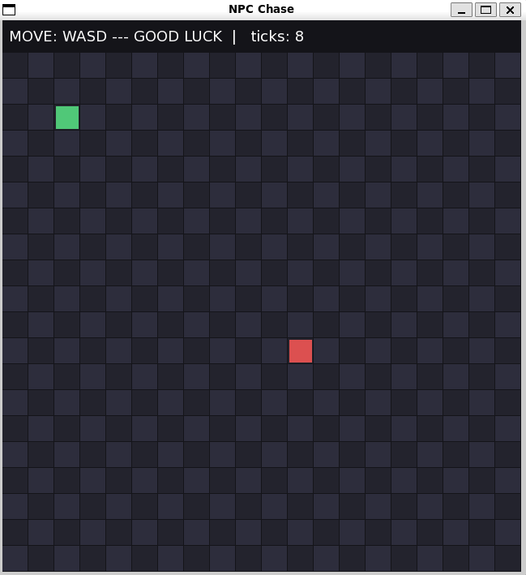

# C++ NPC Chase

A **C++** project where the player moves in a grid while an **NPC with chase AI** follows.  
The enemy uses an axis-priority pathing algorithm to move closer each turn.  
When caught, a **Game Over** screen with **Retry** option is shown.




## Controls
- **W / A / S / D** → Move player  
- **Q** → Quit game  
- **R** / **Enter** / **Mouse Click** → Retry after Game Over
- 
## Build & Run
```bash
sudo apt install g++ libsfml-dev fonts-dejavu-core
g++ -std=c++17 main.cpp -o npc_chase \
    -lsfml-graphics -lsfml-window -lsfml-system
./npc_chase
-

